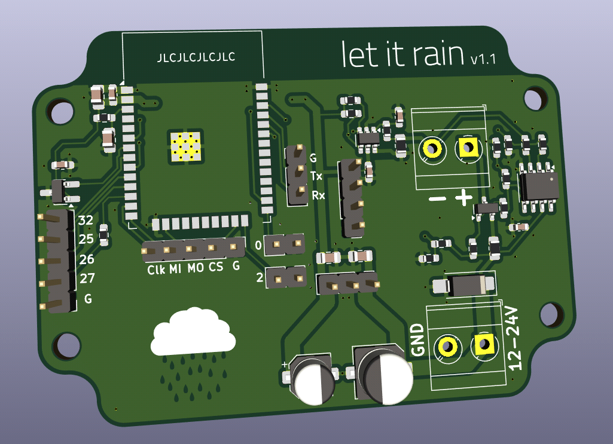

# Let it rain

An ESP32 board intended for use with TL-136 level sensors

## Status

Version 1 was built and is running well.

## Description

The sensor officially requires 24V, but in practice it runs well down to about 7V.
An op-amp is used to limit the current through the sensor and protect the ADC in case
of a short-circuit. The bias current of the op-amp has a small but measureable effect,
however the voltage measured by the ADC is still very linear to the current through the
sensor.

## Software

The board can be used with ESPHome, see [esphome.yaml](esphome.yaml) for an example configuration.

## BOM

 - 1x TL-136 differential pressure level sensor
 - 1x ESP32-WROOM-32x, can be any variant with the same footprint
 - 1x MCP3421 ADC converter
 - 1x OP07 Operational Amplifier
 - 1x MCP9700B temperature sensor (optional)
 - 1x DC-DC module with 780x compatible pins and 3.3V output. Must support 12-18V input

 - MLCC capacitors 0603, X5R or X7R, at least 6.3V
   - 5x 100nF (C1, C2, C3, C5, C6)
   - 1x 1µF (C2)
   - 2x 10µF (C4, C9)
 - MLCC capacitors 0603, X5R or X7R, at least 25V (better 50V)
   - 1x 100nF (C7)
   - 1x 1µF (C8)
 - 1x Polymer capacitor 5.0mm, at least 6.3V, 22µF (C10)
 - 1x Polymer capacitor 6.3mm, at least 25V (better 50V), 10µF (C11)
 - 1x Bidirectional TSV diode, SMA, voltage slightly above max. supply voltage (D1, optional)
 - 1x Pin header 0,1" 1x3 Pins (J3)
 - 1x BSS84 P-Channel Enhancement MOSFET (Q1)
 - 8x Resistor 0603, 10kOhm (R1, R3, R4, R9, R10, R11, R12, R15)
 - 2x Resistor 0603, 47kOhm (R2, R13)
 - 3x Resistor 0603, 1kOhm (R5, R6, R7)
 - 1x Resistor 0805, 100Ohm, high precision (R8)
 - 1x Resistor 0805, 33Ohm (R14)

Optional pin headers are omitted. They are intended for later reuse of spare PCBs.

The enclosure is an RL6115 from Hammond Manufacturing.

## Changelog

### Version 1.1

- Made more room for DC-DC module, it was a tight fit next to the capacitors
- Rotated TSV diode so that silkscreen is correct for unidirectional diodes
- Changed temperature sensor from MCP9701 to MCP9700B, changed footprint from SC70-5 to SOT23-3
- Some cosmetic fixes
- Marked optional stuff as DNP
